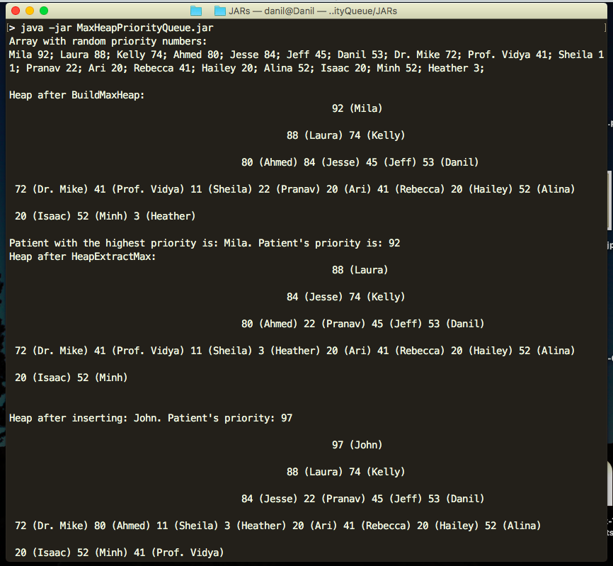

# Max Heap Priority Queue
> Java implementation of Max Heap Priority Queue. 



# Description
This is an array representation of priority queue abstract data type using heap data structure. Keep in mind, my implementation starts at index 1 and ignores index 0 of the array. The program Waiting room mimics an emergency hospital room where patients are prioritized based on the priority number assigned by the user.

Feel free to reach out to me if you have any questions or spot a mistake in the code!

## Usage

Terminal:

Open the folder containing jars and run:

```sh
java -jar WaitingRoom.jar
```
or
```sh
java -jar MaxHeapPriorityQueue.jar
```
## Meta

Danil Kolesnikov – danil.kolesnikov@sjsu.edu

Distributed under the MIT license.
